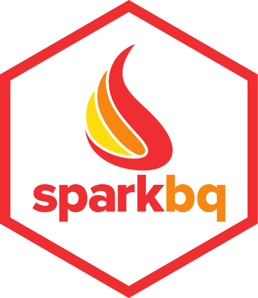

# sparkbq: Google BigQuery Support for Sparklyr

**sparkbq** is a [sparklyr](https://spark.rstudio.com/) [extension](https://spark.rstudio.com/articles/guides-extensions.html) package providing an integration with [Google BigQuery](https://cloud.google.com/bigquery/). It builds on top of [spark-bigquery](https://github.com/miraisolutions/spark-bigquery), which provides a Google BigQuery data source to [Apache Spark](https://spark.apache.org/).

## Version Information

**sparkbq** is under active development and has not been released yet to [CRAN](https://cran.r-project.org/). You can install the latest version through
``` r
devtools::install_github("miraisolutions/sparkbq", ref = "develop")
```

**NOTES**: 
- The current development version of **sparkbq** requires a recent version of sparklyr which addresses [sparklyr#1101](https://github.com/rstudio/sparklyr/issues/1101). You can install the latest version of sparklyr through `
devtools::install_github("rstudio/sparklyr")`.

- Underlying [spark-bigquery](https://github.com/miraisolutions/spark-bigquery) extends [Spotify's spark-bigquery library](https://github.com/spotify/spark-bigquery), which runs queries in [batch mode](https://cloud.google.com/bigquery/docs/running-queries) instead of the interactive mode by default. This may cause queries pending for some time before they could finally run. A [possible improvement](https://github.com/spotify/spark-bigquery/issues/53) has already been accepted by Spotify and will be part of their next release (v0.2.2+).

The following table provides an overview over supported versions of Spark, Scala, and [Google Dataproc](https://cloud.google.com/dataproc/docs/concepts/versioning/dataproc-versions):

| sparkbq | Spark | Scala | Google Dataproc | Comment |
| :-----: | ----- | ----- | --------------- | ------- |
| 0.1.x | 2.2 | 2.11 | 1.2 | active development |


## Example Usage

``` r
library(sparklyr)
library(sparkbq)
library(dplyr)

# Required when running outside of Google Cloud Platform
gcpJsonKeyfile <- "/path/to/your/gcp_json_keyfile.json"

Sys.setenv("GOOGLE_APPLICATION_CREDENTIALS" = gcpJsonKeyfile)
# or
config <- spark_config()
config[["spark.hadoop.google.cloud.auth.service.account.json.keyfile"]] <- gcpJsonKeyfile

sc <- spark_connect(master = "local", config = config)

# Set Google BigQuery default settings
bigquery_defaults(
  billingProjectId = "<your_billing_project_id>",
  gcsBucket = "<your_gcs_bucket>",
  datasetLocation = "US"
)

# Reading the public shakespeare data table
# https://cloud.google.com/bigquery/public-data/
# https://cloud.google.com/bigquery/sample-tables
hamlet <- 
  spark_read_bigquery(
    sc,
    name = "shakespeare",
    projectId = "bigquery-public-data",
    datasetId = "samples",
    tableId = "shakespeare") %>%
  filter(corpus == "hamlet") %>% # NOTE: predicate pushdown to BigQuery!
  collect()
```


## Notes on Authentication
**sparkbq** can be used with Google Dataproc and with Spark deployments outside of the Google Cloud Platform (GCP). The difference lies in how you authenticate with BigQuery. When using Google Dataproc you usually [assign a scope or a service account to your cluster](https://cloud.google.com/sdk/gcloud/reference/dataproc/clusters/create) and then you are automatically authenticated through that. There is no need to specify additional Spark/Hadoop configuration options. Outside of GCP, however, you usually need to authenticate through a [service account](https://developers.google.com/identity/protocols/application-default-credentials), e.g. using a JSON key file. 
