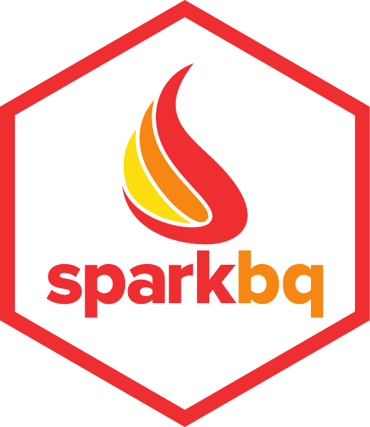

# sparkbq: Google BigQuery Support for sparklyr

[](https://cran.r-project.org/package=sparkbq)

**sparkbq** is a [sparklyr](https://spark.rstudio.com/) [extension](https://spark.rstudio.com/articles/guides-extensions.html) package providing an integration with [Google BigQuery](https://cloud.google.com/bigquery/). It builds on top of [spark-bigquery](https://github.com/miraisolutions/spark-bigquery), which provides a Google BigQuery data source to [Apache Spark](https://spark.apache.org/).


## Version Information

You can install the released version of **sparkbq** from CRAN via
``` r
install.packages("sparkbq")
```
or the latest development version through
``` r
devtools::install_github("miraisolutions/sparkbq", ref = "develop")
```


The following table provides an overview over supported versions of Apache Spark, Scala, and [Google Dataproc](https://cloud.google.com/dataproc/docs/concepts/versioning/dataproc-versions):

| sparkbq | spark-bigquery | Apache Spark    | Scala | Google Dataproc |
| :-----: | -------------- | --------------- | ----- | --------------- |
| 0.1.x   | 0.1.0          | 2.2.x and 2.3.x | 2.11  | 1.2.x and 1.3.x |

**sparkbq** is based on the Spark package [spark-bigquery](https://spark-packages.org/package/miraisolutions/spark-bigquery) which is available in a separate [GitHub repository](https://github.com/miraisolutions/spark-bigquery).


## Example Usage

``` r
library(sparklyr)
library(sparkbq)
library(dplyr)

config <- spark_config()

sc <- spark_connect(master = "local[*]", config = config)

# Set Google BigQuery default settings
bigquery_defaults(
  billingProjectId = "<your_billing_project_id>",
  gcsBucket = "<your_gcs_bucket>",
  datasetLocation = "US",
  serviceAccountKeyFile = "<your_service_account_key_file>",
  type = "direct"
)

# Reading the public shakespeare data table
# https://cloud.google.com/bigquery/public-data/
# https://cloud.google.com/bigquery/sample-tables
hamlet <- 
  spark_read_bigquery(
    sc,
    name = "hamlet",
    projectId = "bigquery-public-data",
    datasetId = "samples",
    tableId = "shakespeare") %>%
  filter(corpus == "hamlet") # NOTE: predicate pushdown to BigQuery!
  
# Retrieve results into a local tibble
hamlet %>% collect()

# Write result into "mysamples" dataset in our BigQuery (billing) project
spark_write_bigquery(
  hamlet,
  datasetId = "mysamples",
  tableId = "hamlet",
  mode = "overwrite")
```


## Authentication

When running outside of Google Cloud it is necessary to specify a service account JSON key file. Information on how to generate service account credentials can be found at https://cloud.google.com/storage/docs/authentication#service_accounts. The service account key file can either be passed as parameter `serviceAccountKeyFile` to `bigquery_defaults` or directly to `spark_read_bigquery` and `spark_write_bigquery`. Alternatively, an environment variable `export GOOGLE_APPLICATION_CREDENTIALS=/path/to/your/service_account_keyfile.json` can be set (see https://cloud.google.com/docs/authentication/getting-started for more information). When running on Google Cloud, e.g. Google Cloud Dataproc, application default credentials (ADC) may be used in which case it is not necessary to specify a service account key file.


## Further Information

* [spark-bigquery on GitHub](https://github.com/miraisolutions/spark-bigquery)
* [spark-bigquery on Spark Packages](https://spark-packages.org/package/miraisolutions/spark-bigquery)

* [BigQuery pricing](https://cloud.google.com/bigquery/pricing)
* [BigQuery dataset locations](https://cloud.google.com/bigquery/docs/dataset-locations)
* [General authentication](https://cloud.google.com/docs/authentication/)
* [BigQuery authentication](https://cloud.google.com/bigquery/docs/authentication/)
* [BigQuery: authenticating with a service account key file](https://cloud.google.com/bigquery/docs/authentication/service-account-file)
* [Cloud Storage authentication](https://cloud.google.com/storage/docs/authentication/)
